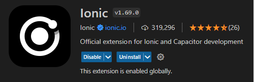

 

# Calendar Week Planer

---

## Description:
This application is based on the [Ionic Framework 7](https://ionicframework.com/) and [Angular 17](https://angular.io). The UI is done with [Angular Material](https://material.angular.io/).   Plan your week with ease by adding todos and time-based activities. Whether it's jogging, hacking, reading, or anything else, schedule your intentions and track your progress. Set goals to stay motivated and ensure a productive week.

Getting started is easy. From the main screen, simply choose the week you want to plan.  You'll then have the flexibility to add:

- Simple to-dos: Perfect for tasks that don't require a specific time commitment.

- Time-based activities: Schedule activities like jogging or reading, and set a time goal for the correspondig week to stay on track.

## How to get this app running ?
The fastest way to get the app running is probably on a PC. 

**Requirements:**
1. [NodeJS and npm](https://nodejs.org)
2. (OPTIONAL) An IDE or Editor if you wanna tweak the code i.e. [Visual Studio Code](https://code.visualstudio.com/)
3. If you are using Visual Studio Code I strongly recommend to install *Ionic* the *Official extension for Ionic and Capacitor development*   

4. The [Ionic CLI](https://ionicframework.com/docs/intro/cli) 
5. The [Angular CLI](https://angular.io/cli)
6. If you plan to deploy this app on your Android Phone you have to install the [Android Studio](https://developer.android.com/studio)

**Installation Procedure:**
1. Clone/download the repo
2. npm install
3. ng serve
4. Browse to http://localhost:4200
5. For Android Deployment I recommend to install [Capacitor Android](https://capacitorjs.com/docs/android) and deploy the app via the Ionic Visual Studio Extension to Android Studio. From the Android Studio you can either run the app in a virtual environment or simply deploy it to your smartphone.

---
## Disclaimer - everything has a little one ;-)
This app is just a little side project (one of many) to get some hands-on experience in using the [Ionic Framework](https://ionicframework.com) in combination with [Angular](https://angular.io). This app is far away from being perfect but it works and I'm using it for keeping track of of my todos and time-based activities on a daily basis. 

Using [@ionic/storage](https://github.com/ionic-team/ionic-storage) for storing the activities and todos just as key/value entries works but could be improved with i.e. using a SQL-lite persistency layer or something similar. Also storing this data in the cloud would be a cool extension.

If you might find this app useful as an example [you decide if it is a good or a bad one ;-)] feel free to participate and add some new features or just fork it for your own experiments. 

---
## License
This app is based on the [MIT Licence](https://opensource.org/license/mit/).

---